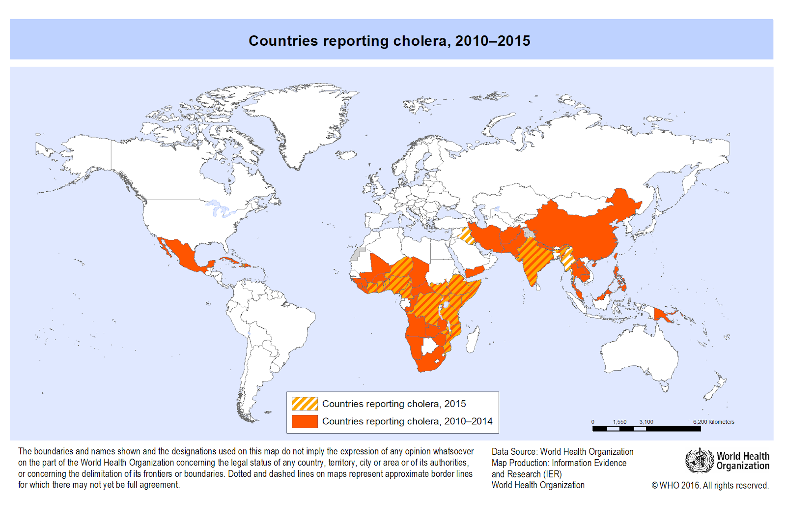
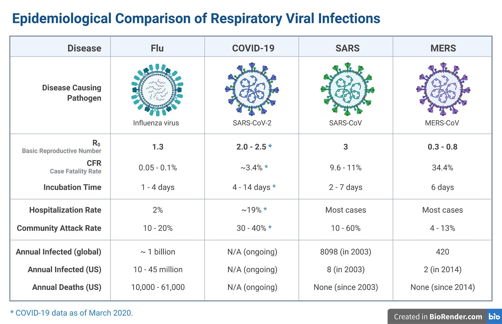
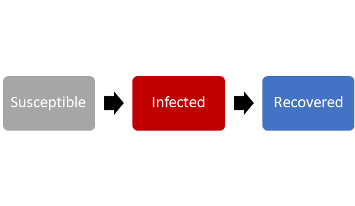
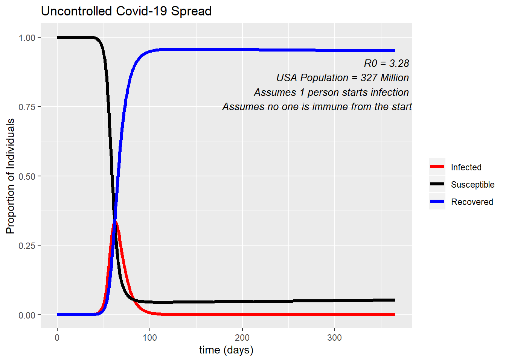
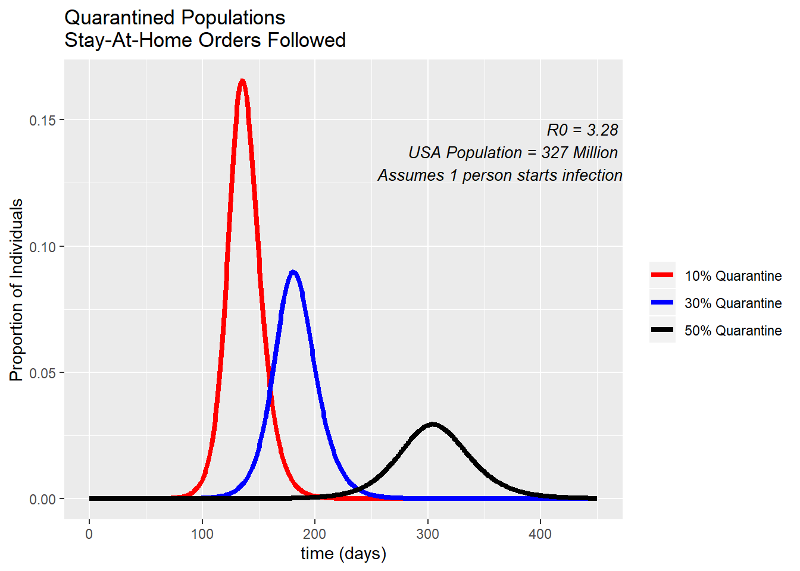
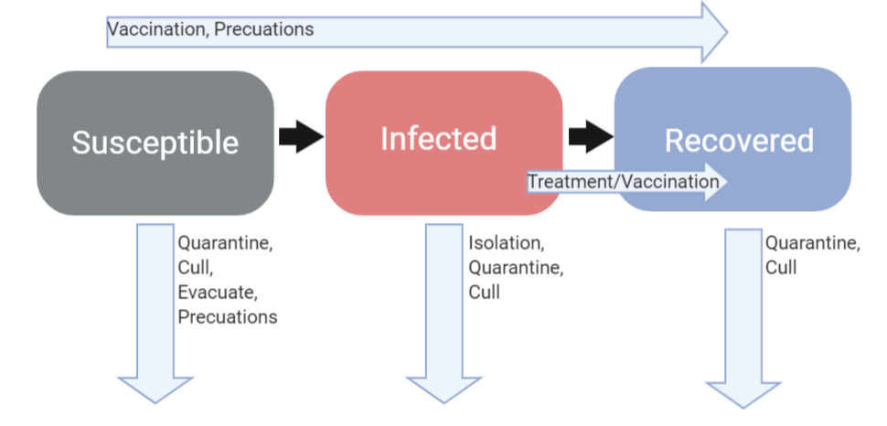

```{r setup, include=FALSE}
knitr::opts_chunk$set(echo = TRUE)
```

# Coronavirus Disease 2019 (COVID-19)

The Coronavirus Disease 2019 (COVID-19) is a respiratory illness caused by a novel, or new, virus, SARS-CoV-2. This novel virus was first identified during an outbreak of respiratory illnesses in Wuhan, China in December 2019. The outbreak in Wuhan is an example of an epidemic, a rise in the number of cases of a disease beyond what is normally expected in a single community or geographical area.  

Since the initial epidemic in Wuhan, the SARS-CoV-2 virus has spread throughout the globe. The World Health Organization has characterized the COVID19 disease as an ongoing pandemic, a disease that affects a large number of people across a wide geographic region or across several countries. In the United States, all 50 states have reported cases of COVID-19.  

The SARS-CoV-2 Virus is spread primarily from person-to-person contact. When a person infected with the virus sneezes or coughs, the virus can be inhaled or ingested by others nearby. The virus may also be spread through contact with contaminated surfaces.  

  

#### Exercise 1 {.tabset .tabset-fade .tabset-pills}

##### Exercise
<style>
div.blue { background-color:#e6f0ff; border-radius: 5px; padding: 20px;}
</style>
<div class = "blue">
Visit [The Corona Virus Map](https://www.nytimes.com/interactive/2020/world/coronavirus-maps.html), generated and updated by the New York Times. Reflect. What may account for the difference in the number of cases, or the burden of disease, between countries? 
</div>

##### Solution
There are many factors that may contribute to the differences in the burden of disease of COVID-19 between countries. We summarize just a few factors here.   
*Example 1.* The virus may have been introduced to different regions at different times. Different countries can be in different phases of the pandemic at any point in time. Even different parts of the same country can be in different phases of a pandemic. Countries with more recent introductions may have fewer cases on today’s date. The first case of COVID-19 in the U.S. was reported on January 21, 2020. The first case of COVID-19 in Papua New Guinea was reported on March 20, 2020.  
*Example 2.* There may be more cases reported in countries with a higher population density, or number of susceptible individuals.  
*Example 3.* Some countries may have responded early to the pandemic, enacting public health interventions to prevent the spread of disease.  
*Example 4.* Testing for COVID-19 may be limited in some countries; while individuals may be ill with COVID-19, the cases are neither tested nor reported.


## Examples of Previous Pandemics 

**Flu Pandemic (1918).** The 1918 flu pandemic was the deadliest pandemic of the 20th century. This pandemic was caused by the H1N1 flu virus. During this pandemic, one-third of the world’s population became infected.  

**Cholera (Current).**  Cholera is an acute diarrheal disease caused by the bacterium Vibrio cholerae. V. cholerae is transmitted through contaminated food or water and is associated with contamination from fecal material. The current (seventh) pandemic started in South Asia in 1961, and reached Africa in 1971 and the Americas in 1991. Cholera is now _endemic_ in many countries, where cases are commonly reported.  

  

**COVID-19 (Current).** The current COVID-19 pandemic is caused by the SARS-CoV-2 Virus and causes a mild to severe respiratory illness. This is the first pandemic known to be caused by the emergence of a new coronavirus.  


# Coronaviruses

Coronaviruses are a large family of spherical RNA viruses that are common among humans and animals. In humans, these viruses can cause acute respiratory illnesses, almost like a cold. In severe cases, these illnesses can lead to pneumonia or even death.  

  


Other known coronaviruses include the **Severe Acute Respiratory Syndrome (SARS)** and **the Middle East Respiratory Syndrome (MERS)**. These are examples of zoonotic disease, diseases that spread between animals and humans.  

The SARS virus originated in small mammals and evolved to infect humans. SARS was first reported in Southern China in 2002 and spread across countries in North America, South America, Europe, and Asia. Cases of SARS have not been reported since 2004.   

The MERS virus originated in camels and then evolved to infect humans. MERS was first reported in 2012 in Saudi Arabia and spread to more than 25 other countries.   
 
## Emergence of the Novel Coronavirus  

Researchers are still investigating the origins of the novel SARS-CoV-2 coronavirus. The virus is thought to be a zoonotic disease. The first cases of COVID-19 were linked to a live animal market in Wuhan, China. The genome of the SARS-CoV-2 virus suggests that it is related to viruses with animal hosts. It is predicted, then, that the virus *spilled over* from an animal host to a human host. Once adapted to the human host, the virus was able to spread from person-to-person.  
  

# Modeling Infectious Diseases  
## Epidemic Curve  

An **epidemic curve**, or epi curve, is a graphical display of the number of illnesses caused by a disease outbreak over time.  
  
#### Exercise 2 {.tabset .tabset-fade .tabset-pills}

##### Exercise
<style>
div.blue { background-color:#e6f0ff; border-radius: 5px; padding: 20px;}
</style>
<div class = "blue">
Complete the CDC’s training on Epidemic Curves, [here](https://www.cdc.gov/training/QuickLearns/epimode/).  
**Predict.** What do you predict would be the shape of the epi curve of the COVID-19 illness in a community? Draw your prediction and label your figure. 
</div>

##### Solution
  

## SIR Model  
*Epidemiologists* and *disease ecologists* use models to help predict the spread of infectious diseases throughout a community or ecosystem. Using a **SER Model**, individuals are classified according to their disease status into the following categories:  
  
  + **Susceptible:** Individuals in this category are susceptible to infection by the parasite. These individuals have not previously been in contact with the parasite, nor do they have any immunity to the parasite.  
  + **Infected:** Individuals in this category have been exposed to and infected by the parasite. These individuals may be *infectious*, and are capable of spreading the parasite to others. Infectious individuals will often display symptoms of the illness caused by the parasite. However, some individuals may not display any symptoms, but are still capable of spreading the parasite. These individuals are *asymptomatic carriers* of the infection.  
  + **Recovered:** Individuals in this compartment are no longer infectious. Once the parasite is detected by the host’s immune system, the immune system fights off the infection. Individuals that recover from infection have often acquired immunity to the parasite.  
  
  

#### Question 1 {.tabset .tabset-fade .tabset-pills}

##### Question
<style>
div.blue { background-color:#e6f0ff; border-radius: 5px; padding: 20px;}
</style>
<div class = "blue">
When does an individual move between the three categories? What determines the rate of this movement? 
</div>

##### Solution
An individual remains in the susceptible category until they are (1) exposed to the parasite and (2) infected by the parasite. The probability of exposure to the parasite and the probability of infection by the parasite will determine how quickly individuals in the S category move into the I category.  
An individual remains in the infected category for the length of time that an individual is capable of transmitting the infection to susceptible individuals. This is known as the *infectious period*.   
An individual moves from the infected category into the recovered category once the host’s immune system clears the infection.  

### SIR Model and the Whole Population  
The same principles that apply to an individual moving between compartments in the SIR model can be applied to a whole population. The graph below is an example of how an SIR model can be applied to the United States population for COVID-19. In this example we start with only one person entering the US who is infected with COVID-19. We see how quickly this disease can spread if left totally uncontrolled. After 100 days, almost the entire population of the US (all 327 million) has been infected - the only ones left in the Susceptible compartment are those being born, and immigrating in. At the peak of infection, 35% of Americans would be sick at a single time, which is 114,450,000 people!  
  

#### Question 2 {.tabset .tabset-fade .tabset-pills}

##### Question
<style>
div.blue { background-color:#e6f0ff; border-radius: 5px; padding: 20px;}
</style>
<div class = "blue">
Under what conditions does the number of infected individuals increase and decrease?
</div>

##### Solution
The number of infected individuals will increase if more individuals enter this category than leave this category. That is, more individuals are becoming infected than are recoverint. The number of infected individuals will decrease when more individuals are recovering than getting infected, usually because the pool of susceptible individuals has decreased.  

## Speed of Spread  

*How fast can an infection spread through a community?*  
The speed at which a parasite can spread through a community is related to the basic reproductive number of the pathogen, the R0 value. You may have noticed it on the “Uncontrolled COVID-19 Spread” graph.  

The R0 value is the number of new infections caused by a single infected individual. The R0 of the COVID-19 infection has been found to have a range from 1.4 - 6.49, with an average of 3.28.(The scientific article that found this can be located [here](https://academic.oup.com/jtm/article/27/2/taaa021/5735319)). This range is due to time period, location, and method of calculation. This means, on average, for every infected individual, there are expected to be 3 new cases that arise.  
  

#### Exercise 3 {.tabset .tabset-fade .tabset-pills}

##### Exercise
<style>
div.blue { background-color:#e6f0ff; border-radius: 5px; padding: 20px;}
</style>
<div class = "blue">
Model the spread of the COVID-19, beginning with a single infected individual and assuming an R0 of 2. How many infections may arise after five generations? The first two generations have been modeled for you. 

</div>

##### Solution  
In the 5th generation there should be 16 infected individuals in the 5th generation.  


#### Exercise 4 {.tabset .tabset-fade .tabset-pills}

##### Exercise
<style>
div.blue { background-color:#e6f0ff; border-radius: 5px; padding: 20px;}
</style>
<div class = "blue">
Make a prediction. Order the following diseases by their contagiousness (R0): COVID-19, Influenza, Measles, Bubonic Plague. Use the [MicrobeScope Application](https://informationisbeautiful.net/visualizations/the-microbescope-infectious-diseases-in-context/) to compare R0 of different diseases.  
</div>

##### Solution   
R0 influenza = 1.53  
R0 measles = 12-18  
COVID-19 = 3.28  
Plague = 3.5


# Public Health Measures   

  There are multiple public health measures that can be put into effect with the aim of stopping or limiting the spread of an infectious disease in a population. The most effective public health measures are related to the disease biology, ecology, and host population. There are six different measures that can be used on their own or in cobination with each other. The most effective responses to slow the spread of an epidemic typically involve more than one public health measure.  
  
### Isolation  
  Isolation is when you remove infected persons from the population. This limits or completely stops their contact with those in the susceptible population, slowing the spread of disease in the population.  
  
### Quarantine  
During the time of the Plauge, the term _quarantine_ referred to the 40 day period that people had to remain on ships before coming to land. Now when people quarantine, it refers to individuals seperating themselves from the population before or after exposure to a disease. By seperating from the population, these individuals prevent transmission to new hosts. Quarantine protects the population from acquiring the disease from exposed individuals.  
  
In the United States, many cities, counties, and states are issuing mandatory “Stay-At-Home” or “Safer-At-Home” orders to their citizens. These orders are instructing people to remain in their home and asking them only to leave for essential functions (e.g. essential jobs, grocery shopping, doctor’s visits). This is a type of quarantine, and when people participate properly, they are playing their part in slowing the spread of COVID-19. 

In the graph below, you can see how the proportion of people infected changes based on what percent of the population abides by the “Safer-At-Home” orders. 

  

The percent of the population abiding by the “Safer-At-Home” policies included in this figure were resported in a recent study by Unacast. If you take a look at [this website](https://www.unacast.com/covid19/social-distancing-scoreboard), you can see how US states are scoring in lowering their activity and physical distancing. Wyoming is doing the worst by only decreasing their activity by 10%, while some states have decreased their activity by 50%. In the United States as a whole, we have decreased our activity by about 36%.  
  
### Treatment (vaccine/Therapeutic Drugs)  
Many diseases have preventative vaccines, or effective drugs that can be used to decrease the spread of the disease. Having a vaccine can make people “recovered” from the disease without ever having to be infected. Drugs that are used for treatment will target those in the infected category, decreasing their infectious period. However, developing these treatments is not an easy feat. Treatments and vaccines for COVID-19 are still in development, some have made their way into clinical trials but it can still take months to be approved by the FDA for general use even on a fast track program.  
  
### Evacuate  
Evacuation is implemented by seperating susceptible individuals from the population. In public health, evacuation is typically used during times of natural disasters. For example, the population of a state may be evacuated while it’s on the path of a category 5 hurricane. Evacuating a population can also play a role in how a disease will spread.  

### Take Precautions   
Precautions are also recommended by public health officials during the COVID-19 pandemic. Precautions include washing your hands properly, using gloves and face masks, respiratory hygiene, cough etiquette (covering your coughs and sneezes), and cleaning and disinfecting environmental surfaces. Doing any or all of these precaution measures can decrease your risk of contracting the disease, and can lower the risk of the passing on the disease.  
  
### Culling  
Culling is the act of decreasing the population through selective slaughter. This practice is used to respond to disease outbreaks in cattle and wildlife. This is not a measure used on humans for human disease. For zoonotic diseases that are passed directly from animals to humans, one of the measures quickly implemented is the culling of the population of infected animals. 

#### Exercise 5 {.tabset .tabset-fade .tabset-pills}

##### Exercise
<style>
div.blue { background-color:#e6f0ff; border-radius: 5px; padding: 20px;}
</style>
<div class = "blue">
Using the SIR compartmental model and the 6 public health measures above, draw arrows describing how each measure will affect the population. Label the arrows with the measure. Note: some measures can affect more than one compartment.  
 
</div>

##### Solution 
 