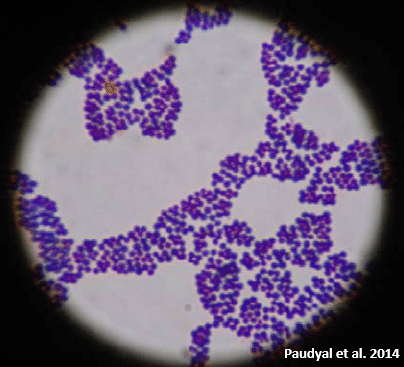
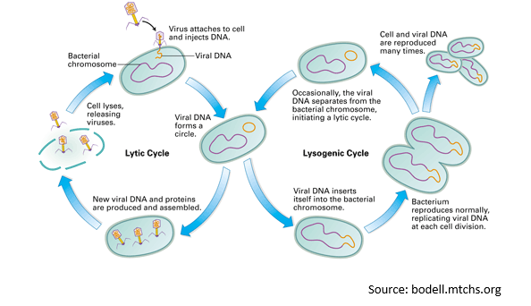
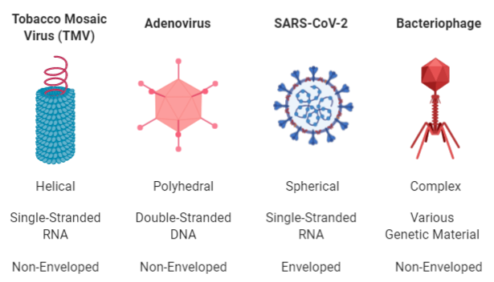

```{r setup, include=FALSE}
library(knitr)
library(kableExtra)
knitr::opts_chunk$set(echo = TRUE)
```

# Introduction  

Microorganisms are found almost everywhere on the planet. Due to the incredible amount of microbial diversity, microbes have evolved to live along the deep-sea floor, among soils and roots, and even inside you! 

Microbes are essential to life; they serve fundamental roles in our ecosystem and are critically important for nutrient cycling. As primary producers, some microbes generate energy through photosynthesis or chemosynthesis. Nitrogen-fixing microbes remove nitrogen from the atmosphere and transform it into forms useable by other organisms. Some microbes are decomposers; they breakdown organic material and release nutrients into the environment. 


Most microbes in the environment are harmless or beneficial, but a small portion of microbes can cause disease. By understanding functions and characteristics of microbes, we may be better able to understand and control the spread of disease.  


# What are Microbes?

A microorganism, or microbe, is any organism that is too small to be seen by the eyes alone. This includes viruses, bacteria, protozoans, and fungi. 


#### Exercise 1 {.tabset .tabset-fade .tabset-pills}

##### Exercise
<style>
div.blue { background-color:#e6f0ff; border-radius: 5px; padding: 20px;}
</style>
<div class = "blue">

Make a prediction. List the following items from largest to smallest:

A.	Coffee Bean 

B.	_E. coli_ Bacteria

C.	Skin Cell

D.	Mitochondria 

E.	Viruses

F.	Grain of Salt


Assess your prediction using the [Cell Size and Scale Tool](https://learn.genetics.utah.edu/content/cells/scale/).

</div>


#### Exercise 2 {.tabset .tabset-fade .tabset-pills}

##### Exercise
<style>
div.blue { background-color:#e6f0ff; border-radius: 5px; padding: 20px;}
</style>
<div class = "blue">

Distinguish between different kinds of microorganisms based on cellular structure. 
Visit the [Cell Anatomy Viewer](https://askabiologist.asu.edu/cell-viewer-game/). Explore the cellular structure of the Animal, Plant, Fungus, and Bacterium. Play the Cell Parts ID Game until you can complete the "Expert Level." Then, fill in create a chart or diagram to compare the cellular structures, using the terms below.  


</div>


 
# Bacteria 

Bacteria are single-celled microbes that are found in diverse environments. The more we look, the more places we find them!

Bacteria are categorized by their shape and structure. You have learned that bacterial cells have both a cell membrane and a cell wall. Bacteria are either Gram-positive or Gram-negative based on the structure of their cell wall. 


#### Exercise 3 {.tabset .tabset-fade .tabset-pills}

##### Exercise
<style>
div.blue { background-color:#e6f0ff; border-radius: 5px; padding: 20px;}
</style>
<div class = "blue">

Based on the figure above, desrcibe the key differences between Gram-positive and Gram-negative bacteria?

</div>  


There are three basic shapes of bacteria: bacillus (rod-shaped), coccus (spherical), and spirochete (spiral).


#### Exercise 4 {.tabset .tabset-fade .tabset-pills}

##### Exercise
<style>
div.blue { background-color:#e6f0ff; border-radius: 5px; padding: 20px;}
</style>
<div class = "blue">Bacteria are classified as Gram-positive or Gram-negative by the results of the _Gram stain method_, or _Gram's method_. Visit the [Gram Stain Virtual Lab](http://learn.chm.msu.edu/vibl/content/gramstain/gramstain/index.html). Read the description of the gram stain method and the steps of the method. 

The image below is a microscopic image of a culture of _Staphylococcus aureus_. What is the gram stain of the bacteria? What is the shape of the bacteria?



</div>  


# Viruses 

Viruses are the smallest microbes and must infect a host cell in order to survive and replicate. These host cells may be cells from humans, plants, animals, or other microorganisms. 


Watch a virus in action, [here](https://youtu.be/-w4C74cu6dk?t=30)! In this animation, a bacteriophage virus infects an _E. coli_ host cell. The step-by-step infection is explained [here](https://www.technologynetworks.com/immunology/videos/bacteriophage-a-virus-that-infects-microbes-311475).


## Are viruses alive? 
This is a common debate, even among scientists! 

Viruses are acellular, meaning that they do not have a cellular structure. Instead, viruses have genetic material that is protected by a protein coat. 

In order to reproduce, viruses must infect and hijack their host's cell or cells in order to replicate their own genetic material. Viruses use the host's cellular machinery, metabolism, and nutrition in order to replicate.

Some viruses may respond to conditions in the host's cell. For example, if a bacteriophage virus enters a host cell, the virus may enter a stage of virulent infection, known as the _lytic cycle_.  During the lytic cycle, the virus will hijack the hosts' machinery immediately. The virus will replicate and then will lyse, or burst, the host's cell. 

In contrast, a bacteriophage virus may 'decide' to remain in a dormant inside the host's cell. In this case, the virus may enter the _lysogenic cycle_, where the viral DNA may replicate but will not burst the host's cell. If the host's cell encounters an environmental stressor, the virus may then transition into the lytic cycle, replicating and lysing the host cell. 



## Virus Structure 
All viruses are composed of genetic material and a protein coat, but viruses may take many different forms and structures. Viruses are classified according to their composition and structure, including their genetic material, their physical shape, and their outer coating. 

**Genetic Material.** Viruses may use DNA or RNA for their genetic material. This material may be double-stranded or single-stranded.

**Physical Shape.** Viruses are classified according to their geometric shape as either helical, polyhedral, spherical, or complex.

**Outer Coating.** All viruses have a protein coat. Enveloped viruses also have a lipid bilayer membrane and glycoproteins. Non-enveloped viruses have only a protein coat, but, non-enveloped viruses are more _persistent_, or hardy, in the environment. 




#### Exercise 5 {.tabset .tabset-fade .tabset-pills}

##### Exercise
<style>
div.blue { background-color:#e6f0ff; border-radius: 5px; padding: 20px;}
</style>
<div class = "blue">
How do viruses compare to other microorganisms? Generate a table to compare viruses to other microorganisms based on size, genetic material, structure, and reproduction.
